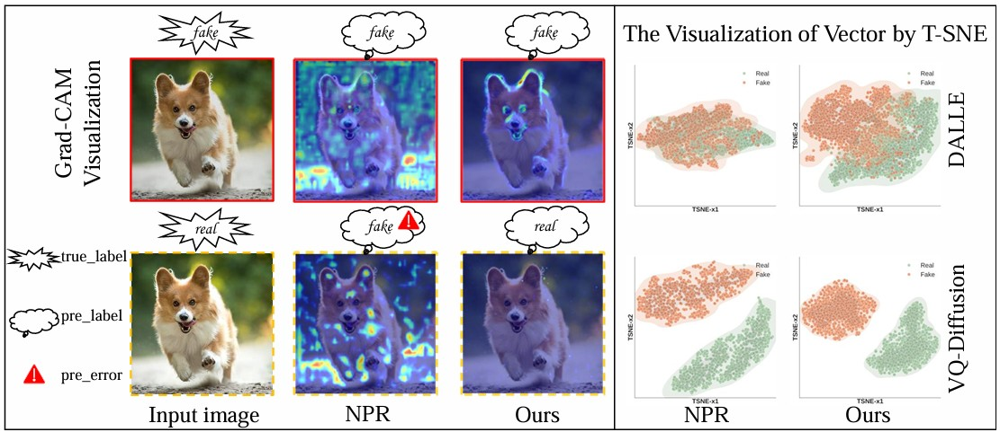

# LFM (BMVC 2025)

[](LICENSE)
[](https://www.python.org/)
[](https://pytorch.org/)

Official PyTorch implementation of **LFM** (BMVC 2025). This repository contains training and evaluation code for our paper "[A Novel Local Focusing Mechanism for Deepfake Detection Generalization]()" accepted at BMVC 2025.

## 📦 Installation

### Prerequisites
- NVIDIA GPU + CUDA cuDNN
- Python 3.10
- PyTorch 2.6+

### Setup Environment

```bash
# Clone repository
git clone https://github.com/lmlpy/LFM.git
cd LFM

# Create and activate conda environment
conda create -n LFM python=3.10.16
conda activate LFM

# Install dependencies
pip install -r requirements.txt
```

### Data preparation

#### Getting the data
<!-- 
Download dataset from [CNNDetection CVPR2020 (Table1 results)](https://github.com/peterwang512/CNNDetection), [GANGen-Detection (Table2 results)](https://github.com/chuangchuangtan/GANGen-Detection) ([googledrive](https://drive.google.com/drive/folders/11E0Knf9J1qlv2UuTnJSOFUjIIi90czSj?usp=sharing)), [UniversalFakeDetect CVPR2023](https://github.com/Yuheng-Li/UniversalFakeDetect) ([googledrive](https://drive.google.com/drive/folders/1nkCXClC7kFM01_fqmLrVNtnOYEFPtWO-?usp=drive_link)), [DIRE 2023ICCV](https://github.com/ZhendongWang6/DIRE) ([googledrive](https://drive.google.com/drive/folders/1jZE4hg6SxRvKaPYO_yyMeJN_DOcqGMEf?usp=sharing)), Diffusion1kStep [googledrive](https://drive.google.com/drive/folders/14f0vApTLiukiPvIHukHDzLujrvJpDpRq?usp=sharing).
-->
|                        | paper  | Url  |
|:----------------------:|:-----:|:-----:|
| Train set              | [CNNDetection CVPR2020](https://github.com/PeterWang512/CNNDetection)                   | [Baidudrive](https://pan.baidu.com/s/1l-rXoVhoc8xJDl20Cdwy4Q?pwd=ft8b)                 | 
| Val   set              | [CNNDetection CVPR2020](https://github.com/PeterWang512/CNNDetection)                   | [Baidudrive](https://pan.baidu.com/s/1l-rXoVhoc8xJDl20Cdwy4Q?pwd=ft8b)                 | 
| Table1 Test            | [CNNDetection CVPR2020](https://github.com/PeterWang512/CNNDetection)                   | [Baidudrive](https://pan.baidu.com/s/1l-rXoVhoc8xJDl20Cdwy4Q?pwd=ft8b)                 | 
| Table2 Test            | [FreqNet AAAI2024](https://github.com/chuangchuangtan/FreqNet-DeepfakeDetection)        | [googledrive](https://drive.google.com/drive/folders/11E0Knf9J1qlv2UuTnJSOFUjIIi90czSj?usp=sharing)   | 
| Table3 Test            | [DIRE ICCV2023](https://github.com/ZhendongWang6/DIRE)                                  | [googledrive](https://drive.google.com/drive/folders/1jZE4hg6SxRvKaPYO_yyMeJN_DOcqGMEf?usp=sharing)   | 
| Table4 Test            | [UniversalFakeDetect CVPR2023](https://github.com/Yuheng-Li/UniversalFakeDetect)        | [googledrive](https://drive.google.com/drive/folders/1nkCXClC7kFM01_fqmLrVNtnOYEFPtWO-?usp=sharing)| 
| Table5 Test            | Diffusion1kStep                                                                         | [googledrive](https://drive.google.com/drive/folders/14f0vApTLiukiPvIHukHDzLujrvJpDpRq?usp=sharing)   | 

#### Data structure
<details>
<summary> Click to expand the folder tree structure. </summary>

```
datasets
|-- ForenSynths_train_val
|   |-- train
|   |   |-- car
|   |   |-- cat
|   |   |-- chair
|   |   `-- horse
|   `-- val
|   |   |-- car
|   |   |-- cat
|   |   |-- chair
|   |   `-- horse
|   |-- test
|       |-- biggan
|       |-- cyclegan
|       |-- deepfake
|       |-- gaugan
|       |-- progan
|       |-- stargan
|       |-- stylegan
|       `-- stylegan2
`-- Generalization_Test
    |-- ForenSynths_test       # Table1
    |   |-- biggan
    |   |-- cyclegan
    |   |-- deepfake
    |   |-- gaugan
    |   |-- progan
    |   |-- stargan
    |   |-- stylegan
    |   `-- stylegan2
    |-- GANGen-Detection     # Table2
    |   |-- AttGAN
    |   |-- BEGAN
    |   |-- CramerGAN
    |   |-- InfoMaxGAN
    |   |-- MMDGAN
    |   |-- RelGAN
    |   |-- S3GAN
    |   |-- SNGAN
    |   `-- STGAN
    |-- DiffusionForensics  # Table3
    |   |-- adm
    |   |-- ddpm
    |   |-- iddpm
    |   |-- ldm
    |   |-- pndm
    |   |-- sdv1_new
    |   |-- sdv2
    |   `-- vqdiffusion
    `-- UniversalFakeDetect # Table4
    |   |-- dalle
    |   |-- glide_100_10
    |   |-- glide_100_27
    |   |-- glide_50_27
    |   |-- guided          # Also known as ADM.
    |   |-- ldm_100
    |   |-- ldm_200
    |   `-- ldm_200_cfg
    |-- Diffusion1kStep     # Table5
        |-- DALLE
        |-- ddpm
        |-- guided-diffusion    # Also known as ADM.
        |-- improved-diffusion  # Also known as IDDPM.
        `-- midjourney
```
</details>

### Training
```bash
python train.py --name lfm --dataroot ./datasets --classes car,cat,chair,horse \
       --batch_size 32 --delr_freq 10 --lr 0.0001 --niter 50
```

### Testing
```bash
python test.py --model_path ./weights/bs_model.pth --batch_size 32
```

## 📌 LFM Visualization


## Acknowledgments
This repository borrows partially from the [NPR](https://github.com/chuangchuangtan/NPR-DeepfakeDetection).

## 📜 Citation
If you find this repository useful for your research, please consider citing:
